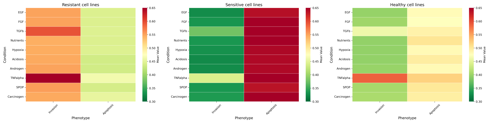
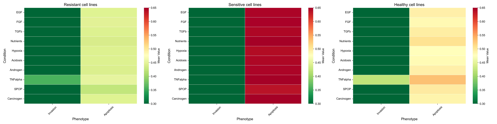

# A Pan-Cancer Computational Pipeline for Modeling Adaptive Resistance to PI3K Inhibitor Pictilisib through Markovian Boolean Network Simulations


## 📌 Overview

This project provides a **computational framework** for analyzing and modeling cell behavior, with a focus on **adaptive resistance mechanisms** in cancer.  

It integrates **Boolean network modeling** with **stochastic simulations** to:

- Identify **key resistance drivers**  
- Validate findings across independent datasets  
- Support the development of **personalized cell models**

### Pipelines included:
- **Main pipeline** → explores resistance pathways and highlights candidate genes  
- **Validation pipeline** → tests different personalization strategies to find the most reliable approach  
- **Baseline pipeline** → runs simulations on the unpersonalized baseline model for comparison  


## Dependency
1. Install miniconda (https://www.anaconda.com/docs/getting-started/miniconda/install)

2. Install MaBoSS dependency
```
conda install -c colomoto maboss
``` 


## Set up

1. In a terminal, create a directory

```
mkdir attractors_project
``` 

2. go inside the directory
```
cd attractors_project
``` 

3. clone the github repo (with all the code) inside the directory 

```
git clone https://github.com/romane-gauthierj/Attractor-Resistance.git
``` 

4. create virtual environment 

```
python -m venv .env
``` 

5. activate virtual environment 
```
source .env/bin/activate
``` 

6. go inside the folder 
```
cd Attractor-Resistance
 
``` 


7. Install requirements txt file that contains all the required library to run the code. In the terminal run:

```
pip install -r requirements.txt
```


8. Load the datasets (original datasets are saved in a drive folder)

```
gdown --folder https://drive.google.com/drive/folders/1Tp_wRLTVEFLWm_mwrubFYBSsbt6xTnQG

```

9. Run the pipelines with the default parameters 

Validation pipeline with the command (100 cell models, personalization using mutations and genes):

```
python run_validation_pipeline.py
```

Main pipeline with the command (35 cell models in each group, Pictilisib drug, personalization using mutations and genes, sigmoid normalization):

```
python run_main_pipeline.py
```


The **Baseline pipeline** (and its results) is available in the [`pipeline_generic.ipynb`](./pipeline_generic.ipynb) notebook.  


## 📊 Outputs & Results

All results are saved in the **`analysis/`** folder.  

---

### 🔬 Main Pipeline  
Default: 35 cell models per group, genes as continuous, mutations as discrete

👉 For quick test runs (but not significant results), reduce models per group (number_patients) to **4**.  

- **Invasion & Apoptosis probability distributions**  
  

- **Heatmap: Resistant, Sensitive, Healthy groups - Before Knockout**  
  

- **Heatmap: Resistant, Sensitive, Healthy groups - After B-catenin Knockout**  
  

---

### 🧪 Validation Pipeline  
Default: 1865 patients per group, genes as continuous, mutations as discrete, sigmoid normalization 

**⚠️ Warning:** The simulation with these settings takes about **8–9 hours** to run.
👉 For quick test runs (but not significant results), reduce patients per group to **4**.  

- **Survival analysis – Proliferation phenotype**  
  

- **Survival analysis – Apoptosis phenotype**  
  


## ⚙️ Configuration

You can customize pipeline settings by editing the [`config.env`](./config.env) file.  
This file controls parameters for **all three pipelines** (main, validation, baseline).  

👉 Make sure you edit the variables for the pipeline you are running.  


### Parameters you can configure:
- **Number of cell models/patients**
- **Drug of interest**
- **Normalization technique**
- **Data types (genes, proteins, mutations, CNVs)**

---

### Example options

```env
# Type of genetic intervention
genetic_intervention     = KO | KI

# Drug of interest
drug_name                = Pictilisib | AZD7762

# Continuous variables
continuous_variable      = genes | proteins | genes_proteins

# Discrete variables
discrete_variable        = mutations | cnv | mutations_cnv

# Normalization methods
normalization_techniques = sigmoid | min-max | log_transf | global_minmax | global_log | distribution_normalization
```

### 📝 How to Change the Number of Patients

You can easily change the default parameters used in your analysis by editing the `config.env` file, here is an example to change the number of patients for the main analysis:

1. Open the configuration file in your terminal:
```
nano config.env
```

2. Find the line that starts with:
number_patients=


3. Change the value to your desired number (e.g., `4` for a quick test run).

4. Save your changes:
- Press `Ctrl+O` to save, then `Enter` to confirm.
- Press `Ctrl+X` to exit nano.

**Tip:**  
Reducing the number of patients (e.g., to 4) will make the pipeline run much faster for testing purposes.